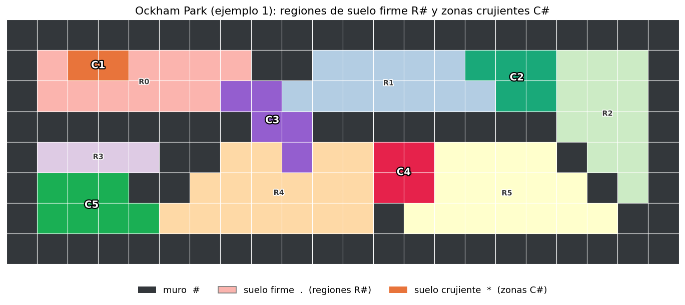
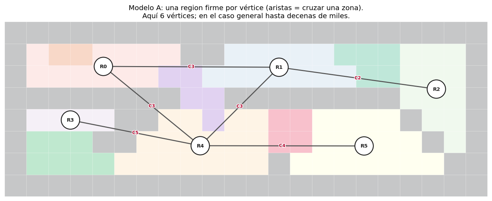
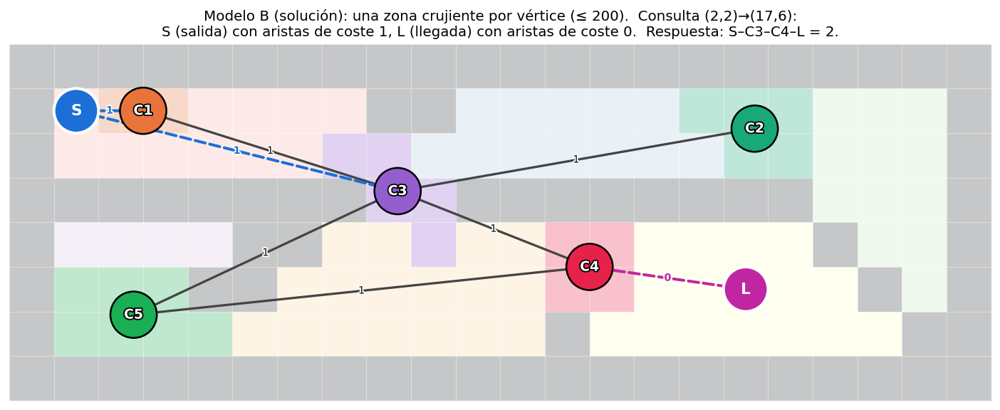

# Introducción a la solución

Nos dan el plano de una mansión como una rejilla de celdas: muros `#`
(infranqueables), suelo firme `.` (por el que se camina en silencio) y suelo
crujiente `*` (que delata a quien lo pisa). Las celdas crujientes conexas (de
forma horizontal o vertical) forman una *zona crujiente*, y se nos garantiza que
no hay más de **200 zonas** en toda la mansión. Para cada consulta, con un origen
y un destino situados sobre suelo firme, hay que dar el **mínimo número de zonas
crujientes** que hay que atravesar para ir de uno a otro (o `-1` si los separan
los muros).

# Idea fundamental: camino mínimo

En cuanto uno reformula "*atravesar el menor número de zonas crujientes*" como
"*camino de coste mínimo sobre un grafo*", la herramienta evidente es un
[Dijkstra](https://es.wikipedia.org/wiki/Algoritmo_de_Dijkstra) o, si las aristas
de nuestro modelado tienen solo pesos 0 o 1, un BFS 0-1.

La dificultad principal del problema no es la elección del algoritmo, sino cómo
modelar el grafo. Algunas modelaciones ingenuas dan resultados correctos pero
demasiado lentos.

Para ilustrar la explicación, trabajaremos sobre el primer ejemplo del
enunciado. Conviene tener a la vista sus piezas: las regiones de suelo firme
(`R0`–`R5`) y las zonas crujientes (`C1`–`C5`).

# Enfoque ingenuo: una celda por vértice

La idea más directa es un grafo con una celda por vértice, uniendo celdas
vecinas transitables. Moverse entre celdas de suelo firme no cuesta nada, y
entrar en una zona crujiente cuesta 1 (por esa zona). Un Dijkstra por consulta
daría la respuesta.

El problema es el tamaño. La rejilla puede tener hasta $10^6$ celdas, y hay
hasta $10^4$ consultas por caso: repetir una búsqueda sobre un millón de
vértices diez mil veces es del orden de $10^{10}$ operaciones, inviable dentro
del tiempo. Necesitamos un grafo mucho más pequeño.

# Mejora: inundar y agrupar (*flood-the-zone*)

La clave es que dentro de una misma región de suelo firme la doncella se mueve
**gratis** en todas direcciones: da igual por qué celda concreta entre o salga.
Podemos, por tanto, colapsar cada maraña de celdas en una sola entidad mediante
un *flood fill* (inundación):

- Cada componente conexa de celdas `.` es una **región firme** (`R0`, `R1`, ...).
- Cada componente conexa de celdas `*` es una **zona crujiente** (`C1`, `C2`, ...).

Atravesar una zona crujiente cuesta 1, sin importar cuántas celdas tenga; y una
región firme conecta gratis todas las zonas que la rodean. El coste de un camino
es simplemente **cuántas zonas crujientes distintas se cruzan**. Sobre esta idea
hay dos formas de montar el grafo, y solo una escala.

# Modelo A: una región firme por vértice (no escala)

La opción más evidente es poner **las regiones firmes como vértices** y unir dos
regiones con una arista de coste 1 cuando comparten una zona crujiente (cruzarla
lleva de una a otra). Una consulta origen→destino es entonces el camino mínimo
entre sus dos regiones.

Es correcto, pero hay demasiados vértices. En el ejemplo salen solo 6
regiones, pero en el caso general el número de regiones firmes crece con la
rejilla: puede haber decenas de miles. Un Dijkstra sobre un grafo tan grande,
repetido para cada una de las hasta $10^4$ consultas, vuelve a irse de tiempo.

Existen mejoras, como reciclar cálculos agrupando las consultas por su región
de origen; así lanzamos un solo Dijkstra por cada origen distinto, y todas las
consultas con la misma región firme de origen se responden en un solo recorrido.
Por desgracia, tampoco basta: en el peor caso cada consulta parte de una región
distinta, así que habría que lanzar hasta $10^4$ búsquedas sobre un grafo de
decenas de miles de nodos. Y precalcular *todas* las distancias entre pares de
regiones es aún peor: con decenas de miles de vértices, una tabla de distancias
de todos contra todos no cabe ni en memoria ni en tiempo. El cuello de botella
es que hay demasiadas regiones firmes.

# Modelo B: una zona crujiente por vértice (la solución)

El enunciado nos garantiza que hay, a lo sumo, 200 zonas crujientes.
Así que damos la vuelta al modelo y ponemos **las zonas crujientes
como vértices**. Dos zonas se unen con una arista de coste 1 si comparten alguna
región firme (se puede caminar de una a otra cruzando solo la segunda). Este
grafo tiene como mucho 200 nodos, pase lo que pase con el tamaño de la rejilla.

Para responder una consulta añadimos dos vértices temporales: uno de *salida*
`S` y otro de *llegada* `L`.

- `S` se conecta con una arista de **coste 1** a cada zona que bordea la región
  del origen (entrar en esa primera zona ya cuesta 1).
- `L` se conecta con una arista de **coste 0** a cada zona que bordea la región
  del destino (esa última zona ya se pagó al entrar en ella; llegar al destino
  desde ella es gratis).

Y lanzamos un Dijkstra de `S` a `L`. Como todos los pesos son 0 o 1, en realidad
basta un **BFS 0-1** (una cola doble), más simple y rápido que un Dijkstra
general.

En la consulta de la figura, de $(2,2)$ a $(17,6)$, el origen está en `R0` (que
bordea `C1` y `C3`) y el destino en `R5` (que bordea `C4`). El mejor camino es
`S → C3 → C4 → L`: se entra en `C3` (coste 1), se pasa a `C4` cruzándola (coste
1) y se llega a `R5` sin coste. En total, se atraviesan dos zonas.

Hay dos casos particulares que conviene tratar aparte:

- Si origen y destino caen en la **misma región firme**, la respuesta es `0`: se
  llega sin pisar nada crujiente.
- Si desde `S` no se alcanza `L` (los separan solo muros), la respuesta es `-1`.

# Soluciones

| Solución | Descripción | Verificado con el juez |
| :------: | :---------- | :--------------------: |
| [C.cpp](src/C.cpp) | Zonas crujientes como vértices (≤ 200); distancias entre zonas por BFS y consultas resueltas combinando las zonas de origen y destino. | :white_check_mark: |
