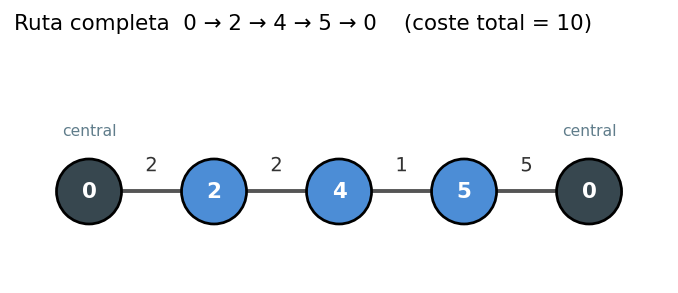
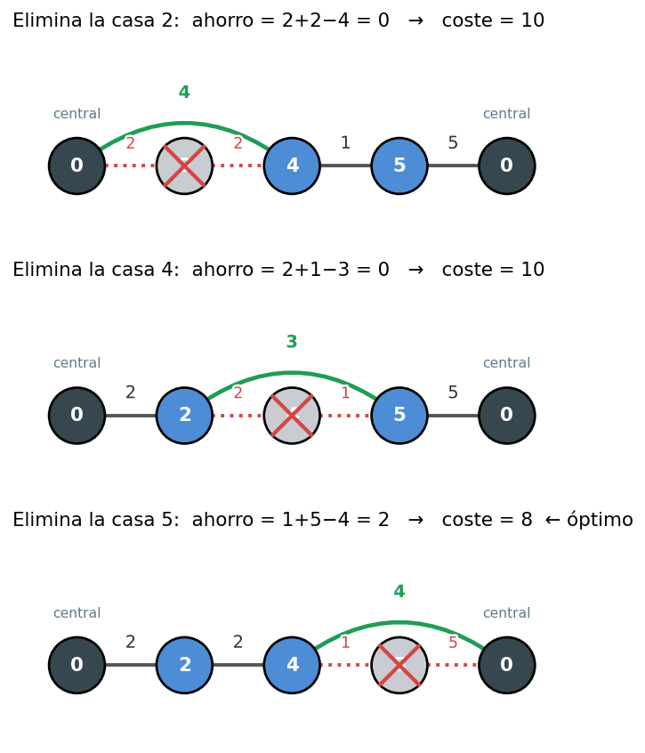

# Introducción a la solución

Mario sale de la central (posición 0), visita $N$ casas en un orden fijo que
no puede alterar y vuelve a la central. Su amigo se encargará de **exactamente
una** de las entregas: al quitar esa casa, Mario se salta esa visita y mantiene
el orden de las demás. Hay que decidir qué casa dejarle al amigo para que la
distancia total que camina Mario sea mínima.

# El coste de la ruta completa

Conviene ver la ruta como una secuencia de posiciones por las que Mario pasa en
orden. Si añadimos la central como un vértice al principio y otro al final
(ambos en la posición 0), la ruta es

$$0,\ a_1,\ a_2,\ \ldots,\ a_N,\ 0,$$

y su coste total es la suma de las distancias entre posiciones consecutivas:

$$\text{total} = |0 - a_1| + |a_1 - a_2| + \cdots + |a_{N-1} - a_N| + |a_N - 0|.$$

En el ejemplo, la ruta $0 \to 2 \to 4 \to 5 \to 0$ tiene coste
$2 + 2 + 1 + 5 = 10$.

Cuando el amigo se lleva una casa $B$, situada en el recorrido entre la
anterior $A$ y la siguiente $C$, el resto de la ruta no cambia en absoluto.
Lo único que ocurre es que:

- dejamos de recorrer las aristas $A \to B$ y $B \to C$, y
- a cambio añadimos una única arista $A \to C$ (Mario va directo de $A$ a $C$).

Por tanto, el **ahorro** de que el amigo haga la casa $B$ es

$$\text{ahorro}(B) = |A - B| + |B - C| - |A - C|.$$

Este ahorro nunca es negativo, por la
[desigualdad triangular](https://es.wikipedia.org/wiki/Desigualdad_triangular):
ir de $A$ a $C$ directamente nunca es más largo que pasar por $B$. Es decir,
saltarse una casa jamás empeora la ruta; a lo sumo la deja igual.

En la figura de abajo se ven los tres estados posibles en el ejemplo, cada uno
eliminando una casa distinta. En rojo, las dos aristas que se pierden; en verde,
la arista directa que las sustituye:

Los extremos merecen cuidado: para la primera casa, su vecina anterior es la
central ($A = 0$); para la última, su vecina siguiente es la central ($C = 0$).
Por eso resulta cómodo tratar la central como esos dos vértices extra en la
posición 0: así toda casa, incluidas la primera y la última, tiene una vecina
por cada lado y la fórmula del ahorro es siempre la misma.

# El algoritmo

Como hay que quitar exactamente una casa, la mejor decisión es quedarse con la
de **mayor ahorro**. El algoritmo es directo y recorre la lista una sola vez:

1. Calcular el coste total de la ruta completa.
2. Para cada casa $a_i$, calcular su ahorro usando sus vecinas $a_{i-1}$ y
   $a_{i+1}$ (con $a_0 = a_{N+1} = 0$).
3. La respuesta es $\text{total} - \max_i \text{ahorro}(a_i)$.

El coste es $O(N)$ por caso, y como la suma de los $N$ está acotada por
$2 \cdot 10^5$, sobra de tiempo.

# Sobre los tipos numéricos

El enunciado garantiza que el coste total de cada ruta no pasa de $10^9$, que
cabe justo en un `int` de 32 bits. Pero los cálculos intermedios del ahorro
suman dos distancias antes de restar (hasta $\sim 2 \cdot 10^9$), lo que sí
se sale del rango de `int`. Para evitar sorpresas conviene usar `long long` en
las sumas de distancias. Las posiciones llegan a $10^9$ y son enteras, así que no
hay ninguna necesidad de números en coma flotante.

# Soluciones

| Solución | Descripción | Verificado con el juez |
| :------: | :---------- | :--------------------: |
| [D.cpp](src/D.cpp) | Coste total de la ruta y, para cada casa, el ahorro $|A-B|+|B-C|-|A-C|$; se resta el ahorro máximo. $O(N)$. | :white_check_mark: |
