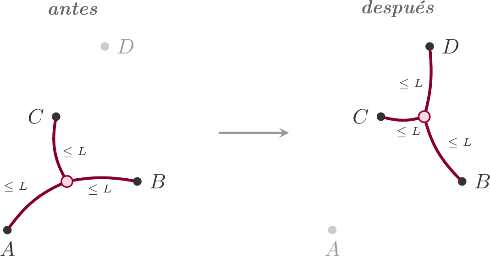
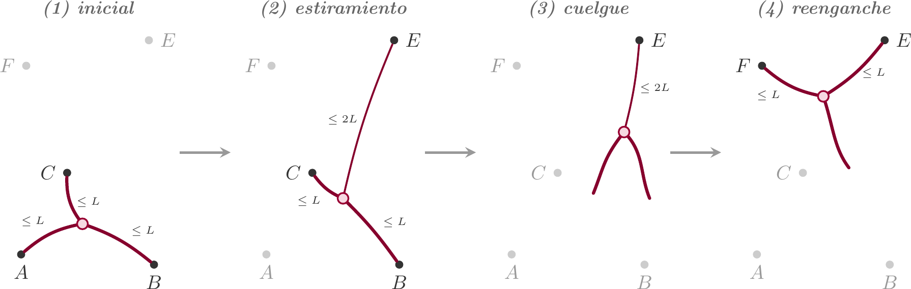

# Problema E - Ventosa Mayor

La Federación Intergaláctica de Montaña y Escalada (FIME) celebra cada año su
campeonato en un planeta distinto, donde escaladores de las especies más diversas
se miden en las paredes locales. Este año la sede es Ventosa Mayor, célebre en toda
la galaxia por sus paredes imposibles y por estar habitado por pulpos de
exactamente tres tentáculos, considerados unos de los mejores escaladores de la
galaxia conocida.

Como miembro de la FIME, se te ha encargado el diseño del muro oficial. Todo un
honor del que presumir años delante de tus amigos, pero ahora toca arremangarse:
tienes los agarres ya colocados sobre la pared y, antes de homologar el recorrido,
debes demostrar a la Federación que un cefalópodo local de élite es capaz de
completarlo. Es una cuestión de cortesía hacia los anfitriones: si el día del
campeonato los pulpos del planeta sede no consiguieran siquiera llegar al agarre
final, el ridículo sería intergaláctico y tu carrera como diseñador quedaría
seriamente comprometida.

La pared se modela como un plano y cada agarre como un punto de coordenadas
$(x, y)$. Los pulpos de Ventosa Mayor tienen tres tentáculos, cada uno con un
alcance normal de hasta $L$ unidades. El cuerpo del pulpo se modela como un único
punto del plano, del que parten los tres tentáculos.

Durante la escalada, se dice que el pulpo está en **posición segura** si al menos
dos de sus tentáculos están sujetos a agarres distintos, cada uno con una longitud
no mayor que $L$. En cada **movimiento ordinario**, el pulpo recoloca un único
tentáculo manteniendo los otros dos en sus agarres. El movimiento es posible si
existe una posición del cuerpo desde la que los tres tentáculos pueden alcanzar a
la vez sus respectivos agarres, los tres con longitud no mayor que $L$. Además, en
ningún momento del recorrido un agarre puede estar ocupado por más de un tentáculo.

En el siguiente esquema se ve cómo el pulpo recoloca un tentáculo del agarre $A$ al
agarre $D$ mientras los otros dos permanecen sujetos a $B$ y $C$.



Una única vez durante el recorrido, el pulpo puede ejecutar una maniobra especial
llamada **estiramiento**. En ella, conservando dos tentáculos sujetos a sus
agarres con longitud no mayor que $L$, alarga el tercero hasta una longitud no
mayor que $2L$ para alcanzar un nuevo agarre. La maniobra es válida si existe una
posición del cuerpo compatible con esas tres longitudes.

En cuanto el tentáculo estirado sujeta el nuevo agarre, el pulpo suelta los otros
dos y queda colgando únicamente de él. Para recobrar una posición segura, el pulpo
debe agarrarse a otro agarre con un tentáculo normal mientras recoge el que estaba
estirado hasta una longitud no mayor que $L$. A partir de ese instante continúa con
movimientos ordinarios. El estiramiento ya no podrá volver a utilizarse.

En el siguiente esquema se puede ver cómo, desde la posición inicial, el pulpo
alarga un tentáculo hasta el agarre $E$ (con longitud $\le 2L$), suelta los otros
dos y queda colgando; después recupera una posición segura agarrándose a $F$ con un
tentáculo normal.



Conviene recalcar que el estiramiento es la única manera que tiene el pulpo de
soltar dos tentáculos a la vez y reorganizar a qué pares de agarres se sujeta.
Alargar el tercer tentáculo hasta $2L$ es opcional: la maniobra también es válida
si el agarre $E$ ya está a longitud $\le L$ del cuerpo. En particular, $E$ no tiene
por qué ser un agarre nuevo: puede ser un agarre que el pulpo ya estuviera usando,
con la única condición de que sea distinto de los agarres a los que siguen sujetos
los otros dos tentáculos durante el estiramiento.

Al comienzo, el pulpo está sujeto a los tres agarres iniciales indicados en la
entrada. El recorrido se considera homologado si en algún instante uno de los
tentáculos del pulpo llega a sujetar el agarre final, ya sea durante un movimiento
ordinario, durante el propio estiramiento o como agarre de reenganche tras él.

Tu tarea es decidir si existe alguna secuencia válida de movimientos que permita al
pulpo alcanzar el agarre final.

## Entrada

La primera línea contiene un entero $T$ ($0 \le T \le 250$), el número de casos de
prueba.

Cada caso comienza con dos enteros $N$ y $L$ ($4 \le N \le 200$ y
$1 \le L \le 10^4$): el número de agarres del muro y la longitud normal de los
tentáculos.

A continuación aparecen $N$ líneas con dos enteros $x_i$ e $y_i$ cada una
($-10^4 \le x_i, y_i \le 10^4$), las coordenadas de los agarres. Las **tres
primeras** líneas son los agarres iniciales a los que el pulpo está sujeto al
comienzo; la **última** es el agarre final que el pulpo debe alcanzar. Las $N - 4$
líneas intermedias son los demás agarres, en cualquier orden. Todos los puntos
ocupan posiciones distintas entre sí, y las posiciones de los tres iniciales son
compatibles con que un pulpo los sujete a la vez.

La suma de los $N$ de todos los casos no excede 1000.

## Salida

Para cada caso de prueba, se escribirá una línea con `SI` si el recorrido puede
homologarse, o `NO` en caso contrario.

## Ejemplos

### Entrada de ejemplo
```
3
4 10
0 0
0 10
0 20
0 35
4 10
0 0
0 10
0 20
0 60
5 3
0 0
3 0
1 2
5 3
7 0
```

### Salida de ejemplo
```
SI
NO
SI
```

## Notas

En el primer caso, los agarres están alineados verticalmente. Aunque los tres
primeros son compatibles entre sí, el agarre final queda fuera del alcance de
cualquier movimiento ordinario. Sin embargo, desde los agarres 2 y 3 el pulpo puede
usar el estiramiento para alcanzar el agarre 4, con lo que llega al agarre final.
Por tanto, la respuesta es `SI`.

En el segundo caso, el agarre final está demasiado lejos. Ni siquiera usando el
estiramiento existe una posición válida desde la que el pulpo pueda alcanzarlo, así
que el recorrido no puede homologarse y la respuesta es `NO`.

En el tercer caso, la solución no necesita usar el estiramiento. Desde una posición
segura apoyada en los agarres 1 y 2, el pulpo puede recolocar el tercer tentáculo
en el agarre 4. Después, manteniéndose en los agarres 2 y 4, puede recolocar el
tentáculo que estaba en el agarre 1 hasta el agarre final 5. Por tanto, también en
este caso la respuesta es `SI`.
