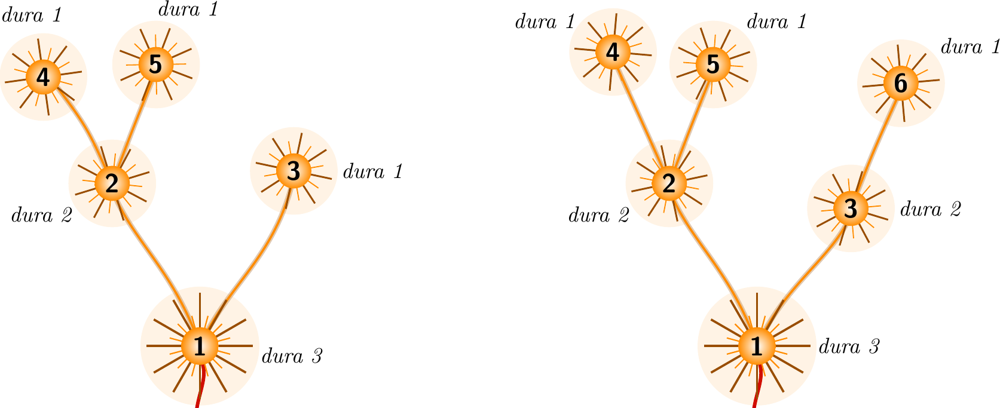

# Problema F - Castillo de fuegos artificiales

La Pirotecnia Brandán lleva tres generaciones iluminando las fiestas mayores de
medio país, y este año le han confiado el castillo que cerrará las fiestas de
Villarriba. Nerea, la pirotécnica jefa, sabe que un castillo no es una ristra de
petardos lanzados al tuntún: es una *coreografía*. Todo arranca con un único
cohete; cuando estalla, su fogonazo prende las mechas de hasta otros dos estallidos,
que reventarán un compás más tarde; cada uno de ellos puede a su vez encender hasta
dos más, y así el castillo se despliega por el cielo. Los estallidos que ya no
encienden nada son las *estrellas finales*, que brillan durante un compás y se
apagan.

Conviene fijarse en que cada estallido del castillo encabeza a su vez un
*subcastillo* propio: el formado por él y por todo lo que se va desencadenando por
encima hasta las estrellas finales que lo cierran. La *duración* de un subcastillo
es el número de compases que pasan desde que se produce su estallido inicial hasta
que se apaga su última luz. Una estrella final, por sí sola, forma un subcastillo
de duración 1.

Para que el efecto resulte bonito, Nerea diseña sus castillos de modo que sean
*armoniosos*: cuando un estallido enciende a dos, los subcastillos que arrancan en
ellos tienen duraciones que difieren entre ellas en un compás como mucho; y cuando
un estallido enciende a uno solo, ese uno es siempre una estrella final.

Pero las estrellas finales son los componentes más baratos del castillo y, con la
humedad de las noches de verbena, a veces una no prende. Por mala suerte que tenga,
fallará a lo sumo una. Nerea quiere castillos *robustos*: armoniosos de partida, y
que sigan siéndolo aunque cualquiera de sus estrellas finales no llegue a brillar.

La figura 1 muestra dos castillos. En el de la izquierda, el estallido inicial 1
enciende dos subcastillos: el del estallido 2, que se ramifica en las estrellas 4 y
5 y dura dos compases, y el de la estrella 3, que dura un compás. Como sus
duraciones difieren en un solo compás, el castillo es armonioso. Pero, sin embargo,
no es robusto: si la estrella 3 no prendiera, el estallido inicial encendería un
único subcastillo, el del estallido 2, que no es una estrella final. El castillo de
la derecha es prácticamente igual, pero con una estrella más, la 6, que sale del
estallido 3: ahora los dos subcastillos del estallido inicial duran dos compases y,
falle la estrella que falle, el castillo sigue siendo armonioso, de modo que sí es
robusto.



*Figura 1: Los dos castillos del ejemplo.*

## Entrada

La primera línea contiene un entero $T$ ($0 \le T \le 10^4$), el número de
castillos.

Cada castillo comienza con una línea con un entero $N$ ($1 \le N \le 2 \cdot 10^5$),
el número de estallidos. Siguen $N$ líneas: la $i$-ésima describe el estallido $i$
con un entero $k_i$ ($0 \le k_i \le 2$) seguido de $k_i$ enteros distintos entre 2
y $N$, los estallidos que enciende. Cada estallido distinto del 1 aparece
exactamente una vez como encendido por algún otro, de modo que la descripción
corresponde a un castillo que pende del estallido 1. Se garantiza además que el
castillo es armonioso.

La suma de los $N$ de todos los castillos no excede $10^6$.

## Salida

Para cada castillo se escribirá una línea con la palabra `SI` si es robusto o `NO`
en caso contrario.

## Ejemplos

### Entrada de ejemplo
```
2
5
2 2 3
2 4 5
0
0
0
6
2 2 3
2 4 5
1 6
0
0
0
```

### Salida de ejemplo
```
NO
SI
```
